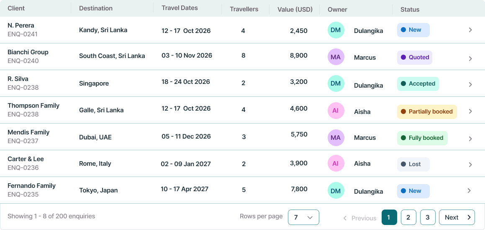

# Planora — Travel Planning Workspace

**Every journey, connected.**

Planora is a desktop UI/UX design concept for travel agents managing client enquiries, trip services and supplier coordination. It brings travel planning into one workspace, with a focus on helping busy agents find information and act quickly.

**Designed by Dulangika Chathurani Malankande · Built in Figma · Design project**

[View the Planora Figma design](https://www.figma.com/design/ZIwKa7xrfR3Aj36LBIhyuA/PLANORA)

> This repository contains design exports, not a working application. Client details, prices and availability are illustrative. Static screenshots do not demonstrate functional booking or authentication.

## Contents

- [The design challenge](#the-design-challenge)
- [Screen previews](#screen-previews)
- [Included designs](#included-designs)
- [Navigation and interactions](#navigation-and-interactions)
- [Visual direction](#visual-direction)
- [Current scope and next steps](#current-scope-and-next-steps)
- [Repository setup](#repository-setup)
- [Credits](#credits)

## The design challenge

Travel agents work with many enquiries at once. They need to identify unanswered requests, follow up quotations and track supplier confirmations without spending time navigating decorative dashboards.

Planora explores how flights, hotels and restaurants can share a consistent workspace while retaining the details needed for each service. The design uses compact information layouts, recognisable actions and labelled statuses to support that workflow.

## Screen previews

### Internal agent dashboard

Operational queues for enquiries, quotations and supplier confirmations, supported by a personal greeting and a travel banner.

### Hotel search and room selection

Property imagery, room types, board basis, cancellation terms and a selection summary. The example demonstrates three rooms over five nights and a property without photographs.

### Login

A shared entry point concept for internal agents and partner agencies.

### Enquiry table

Client, destination, travel dates, traveller count, value, owner and status in a compact table.

### Add service menu

A contextual choice of Flight, Hotel or Restaurant from the trip workspace.

## Included designs

| Area | Exported work |
| --- | --- |
| Brand foundations | Brand board, colour and typography exports, logo asset |
| Splash | Start and ready states |
| Authentication | Login, wrong credentials, account not activated, first-time password setup |
| Dashboard | Internal agent dashboard |
| Enquiries | Page frame and separately exported enquiry table |
| Trip detail | Page frame, service list, client panel, travellers panel and price summary exported separately |
| Add service | Flight, Hotel and Restaurant chooser |
| Hotels | Search results, room comparison, selection summary and missing-photo treatment |

The enquiry and trip detail exports are split into page frames and component images. Their separate exports should not be interpreted as complete assembled page screenshots.

## Navigation and interactions

The intended journey is:

1. Sign in and review the internal agent dashboard.
2. Open Enquiries and select a client request.
3. Review its trip details, travellers, services and estimated total.
4. Select **Add service**, then choose Flight, Hotel or Restaurant.
5. Search and select a service, then add it to the trip.

**Enquiries** remains the active navigation section while building a trip. **Bookings** is intended for managing supplier requests and confirmations. Adding a service to a trip does not itself confirm a reservation.

The add-service chooser is designed as a small overlay anchored below its button. The hotel workflow selects a specific room and quantity rather than only a property.

## Visual direction

- Deep ocean and teal establish the workspace identity.
- Light surfaces and subtle borders separate dense operational content.
- Travel imagery adds context to introductory screens and hotel results.
- Consistent typography, buttons, tabs and service icons connect related screens.
- Text labels accompany status colours so meaning is not conveyed by colour alone.

Enquiry stages include **New, Quoted, Accepted, Partially booked, Fully booked and Lost**. The service status model includes **Draft, Quoted, Requested, Confirmed and Cancelled**; the current trip components demonstrate draft services.

## Current scope and next steps

This is a design portfolio project in progress. The uploaded export contains the work listed above; it does not establish that every assignment state or interaction has been completed.

Further work would include:

- Flight search, fare comparison, connection warnings and no-results state.
- Restaurant availability, alternative times and telephone arrangement flow.
- Partner agency dashboard.
- Enquiry filtering and no-results variants.
- Trip detail examples with zero and fourteen services, including a mixed flight, hotel and restaurant list.
- Complete component states, accessibility review and usability testing with agents.
- Consistent trip data across screens and reconciliation of service prices with totals.
- Complete assembled enquiry and trip screenshots and a verified prototype walkthrough.

Passenger forms, seat maps and ticket issuance are outside the intended selection-screen scope.

## Repository setup

Place this `README.md` at the repository root. Extract the supplied Planora ZIP into a folder named **screens**, retaining its filenames and the `01 — Splash` subfolder. Do not place the ZIP itself inside `screens` in place of the extracted images.

The preview links above use the original exported filenames. If files are renamed, update the matching links in this README.

Optional supporting documentation can be placed in a **docs** folder. The Figma link above opens the design file; a separately verified prototype link can be added later.

## Credits

UI design and Figma assembly: **Dulangika Chathurani Malankande**.

AI assistance was used for design exploration, reference mockups, selected imagery and documentation support. Other photographs and icons remain subject to their original sources and usage terms. The project is presented as a travel workspace concept and does not claim affiliation with the suppliers or destinations shown.
